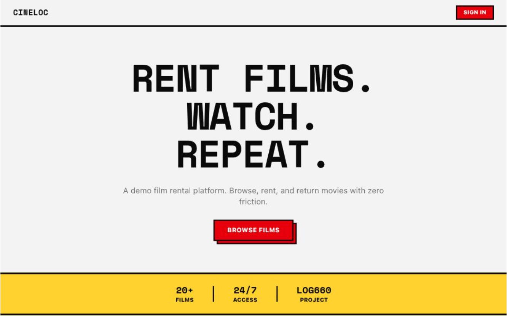
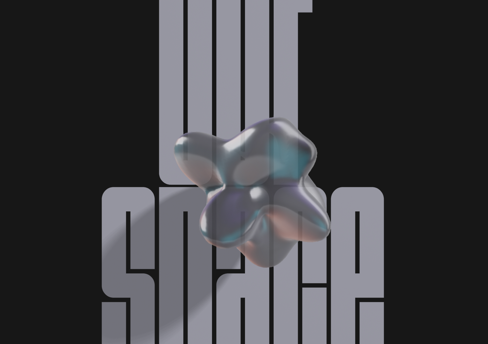
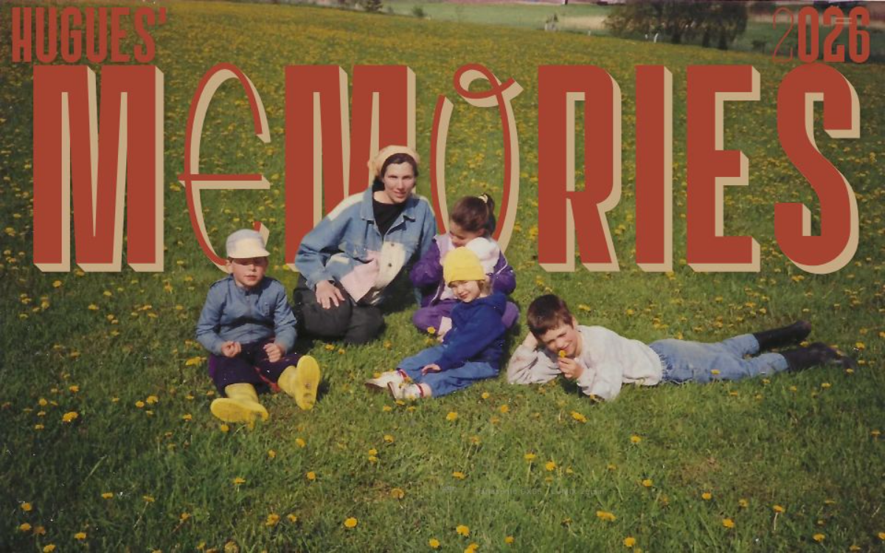

  

  

  

### Connect with me
&nbsp;

&nbsp;&nbsp;&nbsp;&nbsp;

&nbsp;&nbsp;&nbsp;&nbsp;
<a href="mailto:hugues.prudhomme123@gmail.com">
  <picture>
    <source media="(prefers-color-scheme: dark)" srcset="./assets/contact-me/mail-dark.svg">
    <source media="(prefers-color-scheme: light)" srcset="./assets/contact-me/mail-light.svg">
    
  </picture>
</a>
&nbsp;&nbsp;&nbsp;&nbsp;

---
### About me
- 🏢 Software Engineer Student @ [ÉTS](https://www.etsmtl.ca/)
- 🔬 ***Obsessed with efficiency & aestethics***: crafting clean code, designing intuitive UI/UX, and optimizing/automating developer workflows.
- ⚡ ***Current stack***: Typescript, Bun and Hono ~ on Neovim
- ❤️ ***Offline***: I love 3rd wave coffee, climbing and doing family stuff
---

  
  

---

  <picture>
    <source
      media="(prefers-color-scheme: dark)"
      srcset="https://skillicons.dev/icons?i=ts%2Cjs%2Ccss%2Ctailwind%2Cbun%2Cvite%2Creact%2Cnextjs%2Csvelte%2Castro%2Cprisma%2Cmongodb%2Cjava%2Cspring%2Cgradle%2Cselenium%2Cgherkin%2Ckotlin%2Candroidstudio%2Cpython%2Cgo%2Ccs%2Cdotnet%2Cunity%2Cdocker%2Cneovim&perline=13&theme=dark"
    />
    <source
      media="(prefers-color-scheme: light)"
      srcset="https://skillicons.dev/icons?i=ts%2Cjs%2Ccss%2Ctailwind%2Cbun%2Cvite%2Creact%2Cnextjs%2Csvelte%2Castro%2Cprisma%2Cmongodb%2Cjava%2Cspring%2Cgradle%2Cselenium%2Cgherkin%2Ckotlin%2Candroidstudio%2Cpython%2Cgo%2Ccs%2Cdotnet%2Cunity%2Cdocker%2Cneovim&perline=13&theme=light"
    />
    
  </picture>

---

### Projects

  &nbsp;
  &nbsp;
  
  

---

<b>🔬 Currently Studying</b>

 

- GTI525 : Technologies of Internet development
- GTI745 : Advanced User Interfaces
- LOG450 : Mobile Application design
- LOG660 : Introduction to DevOps

<b>🧠 Important Classes Completed</b>

 

- LOG320 : Data structures and algorithms
- GTI350 : Design of UI and UX
- LOG240 : Tests and maintenance
- LOG121 : Oriented Object Programming
- LOG210 : Software Analysis and Design
- GTI611 : IP Communication networks
- ETH610 : Ethics of Artificial Intelligence
- LOG660 : High Performance Database

---
